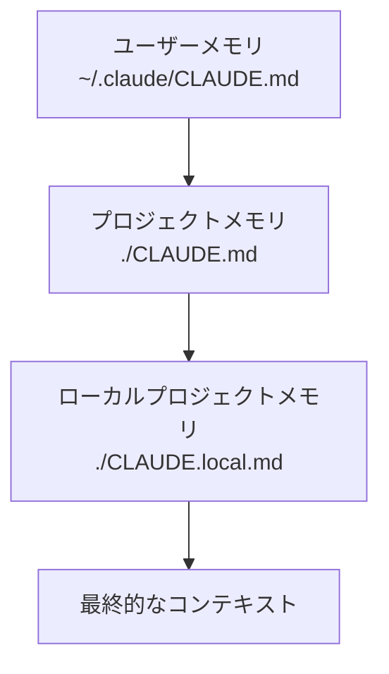

# Claude CodeのClaude.mdファイル完全ガイド（2025年7月時点）

*最終更新: 2025年7月16日*

## はじめに

Claude Codeは、Anthropicが開発したターミナル上で動作するAIコーディングアシスタントです。この記事では、Claude Codeの中核機能である「Claude.mdファイルシステム」について詳しく解説します。

**重要な注意点**: Claude.mdファイルは**会話の記憶を保持しません**。これは多くのユーザーが誤解しやすい点です。

---

## Claude.mdファイルとは

Claude.mdファイルは、Claude Codeが起動時に自動的に読み込む**設定・コンテキストファイル**です。プロジェクト固有の情報、コーディング規約、個人設定などをMarkdown形式で記述できます。

### 基本的な仕組み

```
プロジェクト起動時
↓
Claude.mdファイルを自動検索・読み込み
↓
AIアシスタントにコンテキストとして提供
↓
そのセッション中のみ有効
```

---

## 3階層メモリシステム

Claude Codeは以下の3つのレベルでメモリファイルを管理します：

| レベル | ファイル名 | 場所 | 用途 | Git管理 |
|--------|------------|------|------|---------|
| **プロジェクトメモリ** | `./CLAUDE.md` | プロジェクトルート | チーム共有の規約・アーキテクチャ | ✅ 推奨 |
| **ローカルプロジェクトメモリ** | `./CLAUDE.local.md` | プロジェクトディレクトリ | 個人的なプロジェクト設定 | ❌ .gitignore |
| **ユーザーメモリ** | `~/.claude/CLAUDE.md` | ホームディレクトリ | 全プロジェクト共通の個人設定 | ❌ 個人用 |

### 優先順位と読み込み順序



---

## インポート機能

Claude.mdファイルは、`@path/to/file` 記法で他のファイルを取り込むことができます。

### 基本的なインポート例

```markdown
# プロジェクト設定

@README.md
@docs/architecture.md
@~/.claude/my-preferences.md

## コーディング規約
- インデントは2スペース
- 関数名はcamelCase
```

### インポートの制限事項

| 項目 | 制限 |
|------|------|
| **最大深度** | 5レベルまで |
| **パス形式** | 相対パス・絶対パス両方可能 |
| **再帰インポート** | 可能（深度制限内） |
| **コードブロック内** | インポート不可 |

---

## ❌ 重要な制限：会話の持続性がない

### Claude.mdファイルができること vs できないこと

| ✅ できること | ❌ できないこと |
|---------------|----------------|
| プロジェクト設定の保存 | 過去の会話内容の記憶 |
| コーディング規約の共有 | セッション間での会話履歴 |
| チーム共通ルールの管理 | 前回の作業内容の自動継承 |
| 個人設定の永続化 | 会話コンテキストの継続 |

### セッションごとの動作

```
セッション1:
起動 → Claude.md読み込み → 作業 → 終了 → **会話履歴削除**

セッション2:
起動 → Claude.md読み込み → **前回の会話は記憶なし** → 新しい作業
```

---

## 実用的な使い方

### `/memory` コマンド

```bash
# メモリファイルをエディタで開く
claude /memory

# 特定のメモリを追加
claude # この内容をメモリに追加したい
```

### プロジェクト用Claude.mdファイルの例

```markdown
# MyApp プロジェクト設定

## アーキテクチャ
- フロントエンド: React + TypeScript
- バックエンド: Node.js + Express
- データベース: PostgreSQL

## コーディング規約
- ESLint + Prettier使用
- インデント: 2スペース
- ファイル命名: kebab-case

## 作業フロー
1. feature/xxx ブランチで開発
2. プルリクエスト作成
3. レビュー後マージ

## よく使うコマンド
```bash
npm run dev     # 開発サーバー起動
npm run test    # テスト実行
npm run build   # ビルド
```

## 注意事項
- APIキーは .env.local に配置
- テストデータは test/ ディレクトリ
```

---

## ベストプラクティス

### 📝 効果的な記述方法

| 良い例 | 悪い例 |
|--------|--------|
| `インデントは2スペース` | `適切にフォーマット` |
| `React関数コンポーネントを使用` | `Reactを使う` |
| `エラーハンドリングでtry-catch必須` | `エラー処理をしっかり` |

### 🎯 ファイル構成の推奨事項

```
project/
├── CLAUDE.md              # チーム共有設定
├── CLAUDE.local.md        # 個人設定（gitignore）
├── docs/
│   ├── coding-style.md   # インポート用詳細規約
│   └── deployment.md     # デプロイ手順
└── .gitignore            # CLAUDE.local.mdを除外
```

---

## 技術的制約とパフォーマンス

### コンテキストウィンドウへの影響

Claude.mdファイルのサイズは、AIの利用可能なトークン数に直接影響します。

| ファイルサイズ | 推奨度 | 理由 |
|----------------|--------|------|
| < 1KB | ✅ 最適 | トークン消費minimal |
| 1-5KB | ⚠️ 注意 | 適度な消費 |
| > 5KB | ❌ 非推奨 | 作業領域を圧迫 |

### パフォーマンス最適化のコツ

1. **簡潔な記述**: 冗長な説明を避ける
2. **階層化**: 詳細は別ファイルにインポート
3. **定期的な見直し**: 不要な情報の削除
4. **テンプレート化**: 共通部分の再利用

---

## コミュニティソリューション

### 現在利用可能な回避策

| ソリューション | 概要 | 利用難易度 |
|----------------|------|------------|
| **MCPメモリサーバー** | 外部メモリシステム | 中級者向け |
| **ブートストラップツール** | Claude.md自動生成 | 初心者向け |
| **テンプレートライブラリ** | 設定ファイル集 | 初心者向け |
| **マルチエージェントシステム** | 複雑な記憶管理 | 上級者向け |

---

## まとめ

### Claude.mdファイルの本質

Claude.mdファイルは**「プロジェクト憲法」**として機能し、AIアシスタントに一貫したコンテキストを提供します。ただし、**会話の記憶機能ではない**ことを理解することが重要です。

### 成功のためのポイント

✅ **実行すべきこと**
- プロジェクト固有のルールを明文化
- チームで共有可能な設定を作成
- 定期的なメンテナンス

❌ **期待してはいけないこと**
- セッション間での会話継続
- 自動的な学習機能
- 過去の作業履歴の保持

### 今後の展望

Claude Codeは研究プレビューから正式版に移行しましたが、セッション持続性の問題は未解決です。コミュニティベースの解決策が活発に開発されており、今後のアップデートにも期待が集まっています。

---

*この記事は2025年7月16日時点の情報に基づいています。Claude Codeの仕様は今後変更される可能性があります。*

## 参考リンク

- [Claude Code 公式ドキュメント](https://docs.anthropic.com/en/docs/claude-code/memory)
- [Claude Code GitHub リポジトリ](https://github.com/anthropics/claude-code)
- [Claude 4 リリース情報](https://www.anthropic.com/news/claude-4)
