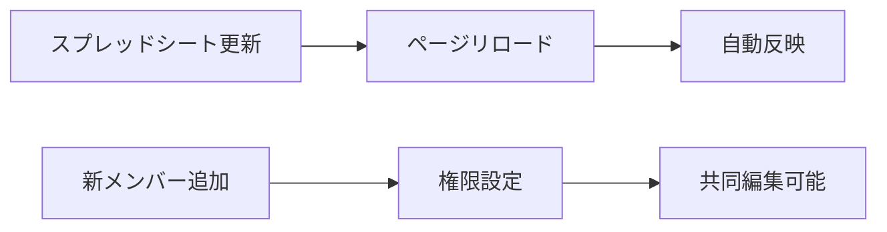

Googleサイト、最近使う備忘録


# Googleサイトにスクロールするリンク集を載せる方法

Google Apps ScriptとSpreadsheetを使って、車がスクロールするような楽しいリンク集を作ってみました。スプレッドシートで簡単にメンテナンスできるのが最大の魅力です！

## デモ

実際の動作。フィルタボタンも動く

codepenで試し書き Resultで見る

<p class="codepen" data-height="300" data-default-tab="html,result" data-slug-hash="XJmYpPj" data-pen-title="動くマーキーDemo" data-user="Ymori_" style="height: 300px; box-sizing: border-box; display: flex; align-items: center; justify-content: center; border: 2px solid; margin: 1em 0; padding: 1em;">
  <span>See the Pen <a href="https://codepen.io/Ymori_/pen/XJmYpPj">
  動くマーキーDemo</a> by YM (<a href="https://codepen.io/Ymori_">@Ymori_</a>)
  on <a href="https://codepen.io">CodePen</a>.</span>
</p>
<script async src="https://public.codepenassets.com/embed/index.js"></script>

## 完成イメージ

- 🚗 車のような見た目のリンクボタンが右から左にスクロール
- ⚙️ ホイールが回転するアニメーション
- 🔍 カテゴリ別フィルタ機能
- 🎯 優先度による色分け表示（赤・黄・緑の点）
- 💬 ツールチップで説明表示

## 技術スタック

- **Google Apps Script (GAS)**: サーバーレスでWebアプリを作成
- **Google Spreadsheet**: データストレージとして利用
- **HTML/CSS/JavaScript**: フロントエンド
- **CSS Animation**: マーキーエフェクトとホイール回転

## Step1: スプレッドシートの準備

### データ構造設計

以下の6列構成でデータを管理します：

| 列 | データ型 | 説明 | 例 |
|---|---|---|---|
| A列 | String | タイトル | "Gemini" |
| B列 | URL | リンク先URL | "https://gemini.google.com" |
| C列 | String | カテゴリ | "AI チャット" |
| D列 | Number | 優先度 (1-5) | 5 |
| E列 | Boolean | 有効/無効フラグ | TRUE |
| F列 | String | 説明文 | "Googleの生成AI・対話型AI" |

### サンプルデータ

```csv
タイトル,URL,カテゴリ,優先度,有効,説明
Gemini,https://gemini.google.com,AI チャット,5,TRUE,Googleの生成AI・対話型AI
Claude,https://claude.ai,AI チャット,5,TRUE,Anthropicの高性能AI助手
Google AI Studio,https://aistudio.google.com,AI 開発,4,TRUE,Googleの生成AI開発プラットフォーム
ChatGPT,https://chat.openai.com,AI チャット,4,TRUE,OpenAIの対話型AI・GPTモデル
NotebookLM,https://notebooklm.google.com,AI ノート,3,TRUE,Googleの文書整理・要約AI
```

## Step2: Google Apps Scriptの実装

### 1. Apps Scriptプロジェクト作成

1. スプレッドシートを開く
2. `拡張機能` → `Apps Script` をクリック
3. プロジェクト名を設定（例：`ScrollingLinkCollection`）

### 2. Code.gsの実装

`doGet()`関数でWebアプリケーションとして公開します：

```javascript
function doGet() {
  const sheet = SpreadsheetApp.getActiveSpreadsheet().getActiveSheet();
  const data = sheet.getRange("A2:F" + sheet.getLastRow()).getValues();
  
  // データフィルタリング・ソート処理
  const validData = data
    .filter(row => row[0] && row[1] && row[4] === true) // 有効なデータのみ
    .sort((a, b) => (b[3] || 0) - (a[3] || 0)); // 優先度降順
  
  // カテゴリごとにグループ化
  const categories = {};
  validData.forEach(row => {
    const category = row[2] || 'その他';
    if (!categories[category]) {
      categories[category] = [];
    }
    categories[category].push(row);
  });
  
  let htmlContent = "";
  let groupCount = 0;
  
  // HTML生成処理
  Object.keys(categories).forEach(category => {
    const categoryData = categories[category];
    let groupHtml = "";
    
    for (let i = 0; i < categoryData.length; i++) {
      const [title, url, cat, priority, enabled, description] = categoryData[i];
      const priorityClass = priority >= 4 ? 'high-priority' : priority >= 2 ? 'medium-priority' : 'low-priority';
      const tooltip = description ? `title="${description}"` : '';
      
      groupHtml += `<a href="${url}" class="link-button ${priorityClass}" onclick="window.open('${url}', '_blank');" ${tooltip}>${title}</a>`;
      
      // 3件ごとにグループ作成
      if ((i + 1) % 3 === 0 || i === categoryData.length - 1) {
        const groupDiv = `
          <div class="link-group" data-category="${category}">
            <div class="category-header">${category}</div>
            <div class="car-top">
              ${groupHtml}
            </div>
            <div class="wheel-container">
              <span class="wheel"></span>
              <span class="wheel"></span>
            </div>
          </div>
        `;
        htmlContent += groupDiv;
        groupHtml = "";
        groupCount++;
      }
    }
  });
  
  // 完全なHTML構造の生成
  const html = generateHTML(categories, htmlContent, groupCount);
  return HtmlService.createHtmlOutput(html);
}

function generateHTML(categories, htmlContent, groupCount) {
  return `
    <!DOCTYPE html>
    <html>
      <head>
        <base target="_top">
        <meta name="viewport" content="width=device-width, initial-scale=1.0">
        <style>
          ${getCSS(groupCount)}
        </style>
      </head>
      <body>
        <h3>📚 リンク集 📚</h3>
        <div class="controls">
          <button class="category-filter active" onclick="filterByCategory('all')">すべて</button>
          ${Object.keys(categories).map(cat => 
            `<button class="category-filter" onclick="filterByCategory('${cat}')">${cat}</button>`
          ).join('')}
        </div>
        <div class="marquee-container">
          <div class="marquee-content">
            ${htmlContent}
          </div>
        </div>
        <script>
          ${getJavaScript()}
        </script>
      </body>
    </html>
  `;
}
```

### 3. CSSスタイリング（抜粋）

アニメーション部分の重要なCSS：

```css
/* マーキーアニメーション */
.marquee-content {
  display: flex;
  animation: marquee 20s linear infinite;
}

@keyframes marquee {
  0% { transform: translateX(100%); }
  100% { transform: translateX(-${groupCount * 320}px); }
}

/* ホイール回転アニメーション */
.wheel {
  width: 45px;
  height: 45px;
  background: radial-gradient(circle, #333, #111);
  border-radius: 50%;
  animation: wheel-spin 1s linear infinite;
}

@keyframes wheel-spin {
  0% { transform: rotate(0deg); }
  100% { transform: rotate(360deg); }
}

/* 道路の破線エフェクト */
.marquee-container::before {
  content: "";
  position: absolute;
  background: repeating-linear-gradient(90deg, #fff 0 20px, transparent 20px 40px);
  animation: road-stripes 1s linear infinite;
}

@keyframes road-stripes {
  0% { background-position: 0 0; }
  100% { background-position: -40px 0; }
}
```

### 4. JavaScript機能

```javascript
function filterByCategory(category) {
  const groups = document.querySelectorAll('.link-group');
  const buttons = document.querySelectorAll('.category-filter');
  
  // アクティブボタンの切り替え
  buttons.forEach(btn => btn.classList.remove('active'));
  event.target.classList.add('active');
  
  // 表示/非表示の制御
  groups.forEach(group => {
    if (category === 'all' || group.dataset.category === category) {
      group.classList.remove('hidden');
    } else {
      group.classList.add('hidden');
    }
  });
}
```

## Step3: デプロイとWebアプリ化

### デプロイ手順

1. **デプロイボタン** → **新しいデプロイ** をクリック
2. **種類の選択**: `ウェブアプリ` を選択
3. **実行ユーザー**: `自分` を選択
4. **アクセス権限**を設定:
   - `自分のみ`: 個人用
   - `Googleアカウントを持つユーザー`: 社内用
   - `全員`: パブリック公開
5. **デプロイ**をクリック
6. 生成された**WebアプリURL**をコピー

### アクセス権限の考え方

```javascript
// 例：社内限定にしたい場合
function doGet(e) {
  const userEmail = Session.getActiveUser().getEmail();
  if (!userEmail.endsWith('@yourcompany.com')) {
    return HtmlService.createHtmlOutput('Access Denied');
  }
  // 通常の処理...
}
```

## 主要機能の技術解説

### 1. 優先度による視覚化

```css
.link-button::before {
  content: '';
  position: absolute;
  width: 6px;
  height: 6px;
  border-radius: 50%;
}

.link-button.high-priority::before {
  background: #dc3545;
  box-shadow: 0 0 8px #dc3545; /* グロー効果 */
}
```

### 2. レスポンシブ対応

```css
@media (max-width: 768px) {
  .link-group {
    width: 250px;
  }
  
  .controls {
    flex-direction: column;
    gap: 5px;
  }
}
```

### 3. パフォーマンス最適化

```javascript
// データ処理の最適化
const validData = data
  .filter(row => row[0] && row[1] && row[4] === true)
  .sort((a, b) => (b[3] || 0) - (a[3] || 0));

// DOM操作の最小化
const fragment = document.createDocumentFragment();
// DOM要素をfragmentに追加してから一括でDOMに追加
```

## メンテナンス性のメリット

### 1. データドリブンアプローチ

- **コード変更不要**: スプレッドシートのデータ変更のみで反映
- **リアルタイム更新**: F5でページ更新すれば最新データが表示
- **権限管理**: Googleの共有設定を活用

### 2. 運用フロー



### 3. 一時的な非表示機能

```javascript
// E列をFALSEにするだけで非表示
.filter(row => row[4] === true)
```

## 活用シーン

### 社内ポータルサイトとして

- 📊 業務ツールのリンク集
- 📝 ドキュメント管理
- 🔧 開発ツール集約

### 学習リソースとして

- 📚 オンライン学習プラットフォーム
- 🎓 技術記事・チュートリアル
- 💡 参考サイト集

### 個人の便利ツールとして

- 🌐 よく使うWebサービス
- 📱 SNS・エンターテイメント
- 🛒 ショッピングサイト

## カスタマイズ例

### アニメーション速度の調整

```css
/* 早くしたい場合 */
.marquee-content {
  animation: marquee 10s linear infinite; /* 20s → 10s */
}

/* ゆっくりしたい場合 */
.marquee-content {
  animation: marquee 30s linear infinite; /* 20s → 30s */
}
```

### 色テーマの変更

```css
/* ダークテーマ */
body {
  background: linear-gradient(135deg, #2c3e50 0%, #3498db 100%);
}

.link-group {
  background: linear-gradient(145deg, #34495e, #2c3e50);
}
```

### 表示件数の調整

```javascript
// 3件ずつ → 5件ずつに変更
if ((i + 1) % 5 === 0 || i === categoryData.length - 1) {
```

## トラブルシューティング

### よくあるエラー

#### 1. `SpreadsheetApp.getActiveSpreadsheet() is null`

```javascript
// 解決法: スプレッドシートIDを直接指定
const sheet = SpreadsheetApp.openById('your-spreadsheet-id').getActiveSheet();
```

#### 2. CSS/JSが読み込まれない

```javascript
// HtmlServiceの設定確認
return HtmlService.createHtmlOutput(html)
  .setXFrameOptionsMode(HtmlService.XFrameOptionsMode.ALLOWALL);
```

#### 3. 権限エラー

```javascript
// 実行権限の確認
function onOpen() {
  const ui = SpreadsheetApp.getUi();
  ui.createMenu('カスタムメニュー')
    .addItem('Webアプリを開く', 'openWebApp')
    .addToUi();
}
```

## セキュリティ考慮事項

### 1. XSS対策

```javascript
// ユーザー入力のサニタイゼーション
function sanitizeHtml(text) {
  return text.replace(/[<>&"']/g, function(match) {
    return {
      '<': '&lt;',
      '>': '&gt;',
      '&': '&amp;',
      '"': '&quot;',
      "'": '&#x27;'
    }[match];
  });
}
```

### 2. URL検証

```javascript
function isValidUrl(url) {
  try {
    new URL(url);
    return true;
  } catch {
    return false;
  }
}
```

## まとめ

Google Apps ScriptとSpreadsheetの組み合わせで、以下を実現できました：

- ✅ **高い保守性**: コード変更不要のデータ管理
- ✅ **視覚的な魅力**: アニメーション効果で楽しい体験
- ✅ **実用的な機能**: カテゴリフィルタ・優先度表示
- ✅ **スケーラブル**: データ件数の増加にも対応
- ✅ **コスト効率**: Google Workspace無料枠で運用可能

スプレッドシートによるデータドリブンアプローチで、技術者以外でも簡単にメンテナンスできるWebアプリケーションが完成しました。

社内ツールや個人サイトでぜひ活用してみてください！

---

## 参考リンク

- [Google Apps Script公式ドキュメント](https://developers.google.com/apps-script)
- [HtmlService Class](https://developers.google.com/apps-script/reference/html/html-service)
- [CSS Animation - MDN](https://developer.mozilla.org/ja/docs/Web/CSS/CSS_Animations)
- [Spreadsheet Service](https://developers.google.com/apps-script/reference/spreadsheet)
