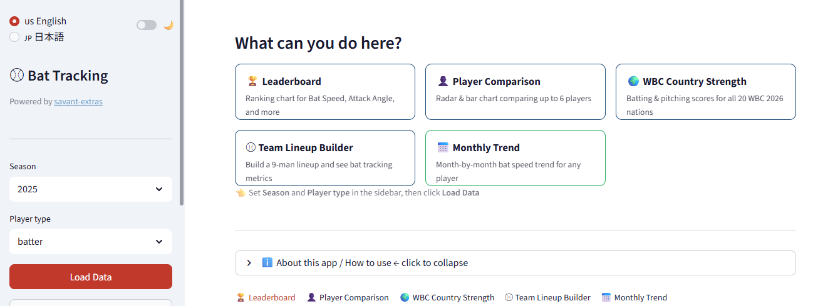

## 作ったもの

Baseball Savant のバットトラッキングデータを可視化する Web ダッシュボードを作りました。

**👉 [MLB Bat Tracking Dashboard](https://yasumorishima-mlb-bat-tracking.streamlit.app/)**



5つのタブで構成しています：

| タブ | 内容 |
|---|---|
| Leaderboard | バットスピード・アタックアングル等のランキング |
| Player Comparison | 最大6選手をレーダーチャート・棒グラフで比較 |
| WBC Country Strength | WBC 2026全20カ国の打撃・投球スコア比較 |
| Team Lineup Builder | MLBチーム別9人ラインナップのバットトラッキング一覧 |
| Monthly Trend | 選手別月次バットスピード推移 |

日本語・英語の2言語切り替えにも対応しています。

---

## データソース: savant-extras

データ取得には自作ライブラリ **savant-extras** を使っています。

```bash
pip install savant-extras
```

Baseball Savant から取得できるバットトラッキングデータをPythonで扱うためのライブラリです。既存の `pybaseball` では日付範囲指定がサポートされていなかったため、補完的な位置づけで作りました。

```python
from savant_extras import bat_tracking, bat_tracking_monthly

# 2025年シーズンの打者バットトラッキングデータ
df = bat_tracking(year=2025, player_type="batter")

# 月次データ
df_monthly = bat_tracking_monthly(year=2025)
```

- GitHub: https://github.com/yasumorishima/savant-extras
- PyPI: https://pypi.org/project/savant-extras/

---

## Streamlit を選んだ理由

データ分析の結果をせっかくなら見やすい形で公開したいと思い、Streamlit をはじめて触ってみました。

選んだ理由は主に3つです：

- **Python だけで書ける** ← HTML/CSS/JS の知識が不要
- **Streamlit Community Cloud で無料公開できる**（GitHub と連携するだけ）
- **`st.selectbox()` や `st.slider()` など、UIパーツが1行で書ける**

実際、こんな感じで書くだけでサイドバーにプルダウンが出てきます：

```python
import streamlit as st

year = st.sidebar.selectbox("Season", [2024, 2025], index=1)
player_type = st.sidebar.selectbox("Player type", ["batter", "pitcher"])
```

---

## 実装のポイント

### `@st.cache_data` でAPI呼び出しを抑制

毎回データを取得すると時間がかかるため、`@st.cache_data` でキャッシュします。

```python
@st.cache_data(ttl=3600)
def load_bat_data(year: int, player_type: str):
    return bat_tracking(year=year, player_type=player_type)
```

同じ引数での呼び出しはキャッシュから返されるため、タブを切り替えるたびに待たされることがなくなります。

### `session_state` でタブ間のデータ共有

Streamlit はページ操作のたびにスクリプト全体が再実行されます。そのため「ボタンを押したあとのデータ」を保持するには `st.session_state` を使います。

```python
if load_btn:
    st.session_state["df_raw"] = load_bat_data(year, player_type)

if "df_raw" in st.session_state:
    df = st.session_state["df_raw"]
```

### `matplotlib-fontja` で日本語フォント対応

日本語ラベルを含むグラフを描画するために `matplotlib-fontja` を使っています。

```python
import matplotlib_fontja  # noqa: F401  ← これを import するだけで日本語が使える
```

---

## 詰まったところ

### `japanize_matplotlib` が Python 3.13 で動かない

Streamlit Community Cloud にデプロイしたところ、以下のエラーが出ました：

```
File "japanize_matplotlib/japanize_matplotlib.py", line 5, in <module>
    from distutils.version import LooseVersion
ModuleNotFoundError
```

`distutils` は Python 3.12 で非推奨、3.13 で完全削除されています。`runtime.txt` に `python-3.11` と書いてバージョンを固定しようとしましたが効かなかったため、`matplotlib-fontja` に乗り換えることで解決しました。

`requirements.txt` の変更はこれだけです：

```diff
- japanize-matplotlib>=1.1
+ matplotlib-fontja
```

---

## データの注意事項

このダッシュボードのデータについて、いくつか注意点があります：

- **MLB所属選手のみが対象**です。NPBやマイナーリーグの選手は含まれません
- **名前マッチングに限界があります**。表記揺れや同姓同名がある場合、正しく紐づかないことがあります
- **WBC 2026 のスコアは暫定値**です。Baseball America 2025年2月時点のロスター情報をもとにしており、実際のロスターとは異なる可能性があります
- バットトラッキングデータの正確性は Baseball Savant の精度に依存します

あくまで参考程度にご覧ください。

---

## まとめ

- **savant-extras**（自作ライブラリ）でデータ取得
- **Streamlit** で5タブのダッシュボードを構築
- **Streamlit Community Cloud** でそのまま公開

Streamlit、思ったより書きやすかったです。`st.tabs()` でタブ分け、`st.expander()` でアコーディオン、`st.columns()` でカラムレイアウト、くらいを覚えるだけでそれなりの見た目になりました。

データ分析の結果を「見せる形」にするのにちょうどいいツールだと思います。

---

## リンク

- アプリ: https://yasumorishima-mlb-bat-tracking.streamlit.app/
- savant-extras (PyPI): https://pypi.org/project/savant-extras/
- savant-extras (GitHub): https://github.com/yasumorishima/savant-extras
- Baseball Savant: https://baseballsavant.mlb.com/
